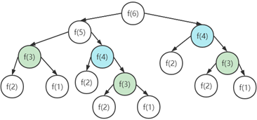
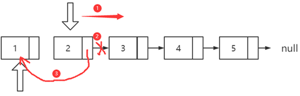
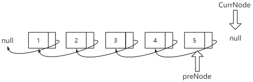
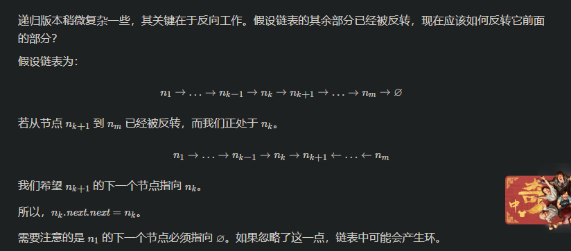
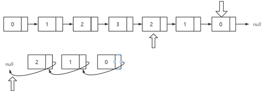
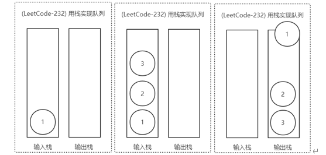

宫水三叶刷题指南：  https://github.com/SharingSource/LogicStack-LeetCode/wiki

# 常用函数

## 1. insert

```java
StingBuilder str1 = new StingBuilder();
str1 = "0";
 
if (str1.length() != 10){
    for (int i = 0; i < 10; i++){
        str1.insert(0 , "0");
    }
}
//如果str1的长度不够10，就会给它的左侧补"0"一直补10位
```

## 2.java双端队列

https://blog.csdn.net/qq_43431863/article/details/123082435


## 3.substring(start,end)

截取从start到end-1的字符串

# 一 递归

## 70 爬楼梯

#### 方法2

仔细分析我们上面的实现，最大的问题是什么？存在着大量的重复计算，我们以f(6)来分析一下：

​                               

可以看到在f(6)的求解过程中，f(3)和f(4)都被求解了多次，这个其实是没必要的，我们可以通过一个HashMap来保存已经求解过的f(k)。当递归调用到f(k)时，先看下是否已经求解过了。如果是，则直接从散列表中取值返回，不需要重复计算，这样就能避免刚讲的问题了。

这种方法的时间复杂度为O(n)。


# 二 数组

## [88. 合并两个有序数组](https://leetcode-cn.com/problems/merge-sorted-array/)

法一

```java
/*数组合并在一起后，再进行排序,时间复杂度来为O((m+n)log(m+n))，空间复杂度为：O(log(m+n))*/
public static void mergeNormal(int[] nums1, int m, int[] nums2, int n) {
    for (int i = 0; i< n; ++i) {
        nums1[m + i] = nums2[i];
    }
    Arrays.sort(nums1);
}
```

法二

```Java
/*双指针处理,时间复杂度来为O(m+n)，空间复杂度为：O(m+n)*/
public static void mergeFast(int[] nums1, int m, int[] nums2, int n) {
    int k = m+n;
    int[] temp = new int[k];
    for(int index = 0,nums1Index = 0,nums2Index = 0; index < k; index++){
        if(nums1Index >= m){/*nums1数组已经取完，完全取nums2数组的值即可*/
            temp[index] = nums2[nums2Index++];
        }else if(nums2Index >= n){/*nums2数组已经取完，完全取nums1数组的值即可*/
            temp[index] = nums1[nums1Index++];
        }else  if(nums1[nums1Index] < nums2[nums2Index]){
            /*nums1数组的元素值小于nums2数组，取nums1数组的值*/
            temp[index] = nums1[nums1Index++];
        }else{/*nums2数组的元素值小于等于nums1左边数组，取nums2数组的值*/
            temp[index] = nums2[nums2Index++];
        }
    }
    for(int i = 0; i < k; i++){
        nums1[i] = temp[i];
    }
}
```

法三

```java
/*双指针逆序处理，时间复杂度来为O(m+n)，空间复杂度为O(1)*/
public static void mergeFastLessSpace(int[] nums1, int m, int[] nums2, int n) {
    int k = m+n;
    for(int index = k-1,nums1Index = m-1,nums2Index = n-1;
        index >= 0;
        index--){
        if(nums1Index < 0){/*nums1已经取完，完全取nums2的值即可*/
            nums1[index] = nums2[nums2Index--];
        }else if(nums2Index < 0){/*nums2已经取完，完全取nums1的值即可*/
            break;
        }else  if(nums1[nums1Index] > nums2[nums2Index]){/*nums1的元素值大于nums2，取nums1值*/
            nums1[index] = nums1[nums1Index--];
        }else{/*nums2的元素值大于等于nums1，取nums2的值*/
            nums1[index] = nums2[nums2Index--];
        }
    }
}
```


## [283. 移动零](https://leetcode-cn.com/problems/move-zeroes/)

## [448. 找到所有数组中消失的数字](https://leetcode-cn.com/problems/find-all-numbers-disappeared-in-an-array/)   

秒啊

方法一：

```java
List<Integer> temp=new ArrayList<>();
        Set<Integer> res=new HashSet<>();
        //把数组元素放入set集合
        for(int i=0;i<nums.length;i++)
            res.add(nums[i]);
        System.out.println("["+res+"]");
        for(int i=1;i<=nums.length;i++){
        //如果集合可以添加元素，则将之加入结果
            if(res.add(i))
                temp.add(i);
        }
        return temp;
```


方法二：以自身作为索引 值和索引一一对应

```java
List<Integer> res=new ArrayList<>();
        for(int i=0;i<nums.length;i++){
            if(nums[Math.abs(nums[i])-1]>0)
                nums[Math.abs(nums[i])-1]=-Math.abs(nums[Math.abs(nums[i])-1]);
        }
        for(int i=0;i<nums.length;i++){
            if(nums[i]>0)
                res.add(i+1);
        }
        return res;
```

方法三：原理和方法二一致

```java
 //对应索引的值加上一个没在数组中出现的数
        int n=nums.length;
        List<Integer> res=new ArrayList<>();
        for(int num:nums){
            int x=(num-1)%n;   /*对n取模来还原出它本来的值*/
            nums[x]+=n;
        }
        for(int i=0;i<n;i++){
            if(nums[i]<=n){
                res.add(i+1);
            }
        }
        return res;
```


# 三 链表

## 21. 合并两个有序链表

法二：递归     有点东西

思路
标签：链表、递归
这道题可以使用递归实现，新链表也不需要构造新节点，我们下面列举递归三个要素
终止条件：两条链表分别名为 l1 和 l2，当 l1 为空或 l2 为空时结束
返回值：每一层调用都返回排序好的链表头
本级递归内容：如果 l1 的 val 值更小，则将 l1.next 与排序好的链表头相接，l2 同理
O(m+n)O(m+n)，mm 为 l1的长度，nn 为 l2 的长度

```java
class Solution {
    public ListNode mergeTwoLists(ListNode l1, ListNode l2) {
        if(l1 == null) {
            return l2;
        }
        if(l2 == null) {
            return l1;
        }

        if(l1.val < l2.val) {
            l1.next = mergeTwoLists(l1.next, l2);
            return l1;
        } else {
            l2.next = mergeTwoLists(l1, l2.next);
            return l2;
        }
    }
}
```


其实递归就是程序内部维护了一个栈。这个题就是每次都把最小值压入栈，最后出栈的时候，将所有数连在一起就可以了。说白了，就是用一个栈维护了顺序。最后的连接，当然是小的连小的，所以l1 小，就连到 l1,l2 小就连到 l2，最后先返回的，就是最小的头结点。


## [83. 删除排序链表中的重复元素](https://leetcode-cn.com/problems/remove-duplicates-from-sorted-list/)

方法一：

```java
public ListNode deleteDuplicates(ListNode head) {
    if (head == null) {
        return head;
    }

    ListNode currentNode = head;
    while(null != currentNode.next){
        if(currentNode.next.val == currentNode.val){
            currentNode.next = currentNode.next.next;
        }else {
            currentNode = currentNode.next;
        }
    }
    return head;
}
```


方法二  

```java
/*递归处理,在本质上其实就是将链表压栈后倒序处理了*/
public ListNode deleteDuplicatesRecursive(ListNode head) {
    if(head == null || head.next == null) return head;
    head.next = deleteDuplicates(head.next);
    return head.val == head.next.val ? head.next : head;
}
```


## [141. 环形链表 I](https://leetcode-cn.com/problems/linked-list-cycle-ii/)

## [142. 环形链表 II](https://leetcode-cn.com/problems/linked-list-cycle-ii/)


## [160. 相交链表](https://leetcode.cn/problems/intersection-of-two-linked-lists/)

法一：直接双指针

```java
 public ListNode getIntersectionNode2(ListNode headA,ListNode headB){
        if(headA==null||headB==null) return null;
        ListNode pA=headA,pB=headB;
        while(pA!=pB){
            pA=pA==null?headB:pA.next;
            pB=pB==null?headA:pB.next;
        }
        return pA;
    }
```


## [206. 反转链表](https://leetcode.cn/problems/reverse-linked-list/)

方法一：迭代





方法二：递归    写出bug了



```java
/**
     * 以链表1->2->3->4->5举例
     * @param head
     * @return
     */
    public ListNode reverseList(ListNode head) {
        if (head == null || head.next == null) {
            /*
                直到当前节点的下一个节点为空时返回当前节点
                由于5没有下一个节点了，所以此处返回节点5
             */
            return head;
        }
        //递归传入下一个节点，目的是为了到达最后一个节点
        ListNode newHead = reverseList(head.next);
                /*
            第一轮出栈，head为5，head.next为空，返回5
            第二轮出栈，head为4，head.next为5，执行head.next.next=head也就是5.next=4，
                      把当前节点的子节点的子节点指向当前节点
                      此时链表为1->2->3->4<->5，由于4与5互相指向，所以此处要断开4.next=null
                      此时链表为1->2->3->4<-5
                      返回节点5
            第三轮出栈，head为3，head.next为4，执行head.next.next=head也就是4.next=3，
                      此时链表为1->2->3<->4<-5，由于3与4互相指向，所以此处要断开3.next=null
                      此时链表为1->2->3<-4<-5
                      返回节点5
            第四轮出栈，head为2，head.next为3，执行head.next.next=head也就是3.next=2，
                      此时链表为1->2<->3<-4<-5，由于2与3互相指向，所以此处要断开2.next=null
                      此时链表为1->2<-3<-4<-5
                      返回节点5
            第五轮出栈，head为1，head.next为2，执行head.next.next=head也就是2.next=1，
                      此时链表为1<->2<-3<-4<-5，由于1与2互相指向，所以此处要断开1.next=null
                      此时链表为1<-2<-3<-4<-5
                      返回节点5
            出栈完成，最终头节点5->4->3->2->1
         */
        head.next.next = head;
        head.next = null;
        return newHead;
    }
```


[234. 回文链表](https://leetcode.cn/problems/palindrome-linked-list/)

方法一：快慢指针+反转链表



这种方法的时间复杂度O(n)，空间复杂度O(1)。

```java
class Solution {
    public boolean isPalindrome(ListNode head) {
        ListNode slow=head,fast=head;
        while(fast!=null&&fast.next!=null){
            slow=slow.next;
            fast=fast.next.next;
        }
        if(fast!=null){
            slow=slow.next;
        }
        fast=head;
        ListNode temp=reverseList(slow);
        while(temp!=null){
            if(temp.val!=fast.val) return false;
            temp=temp.next;
            fast=fast.next;
        }
        return true;
    }
    public ListNode reverseList(ListNode node){
        ListNode pre=null,cur=node;
        while(cur!=null){
            ListNode next=cur.next;
            cur.next=pre;
            pre=cur;
            cur=next;
        }
        return pre;
    }
    
}
```


## [876. 链表的中间结点](https://leetcode.cn/problems/middle-of-the-linked-list/)

思路：快慢指针

## [剑指 Offer 22. 链表中倒数第k个节点](https://leetcode.cn/problems/lian-biao-zhong-dao-shu-di-kge-jie-dian-lcof/)

思路：快慢指针


# 四 栈和队列

## [232. 用栈实现队列](https://leetcode.cn/problems/implement-queue-using-stacks/)

#### 方法1

我们知道栈是后进先出的，为了保证最终形成的队列符合先进先出的的定义，我们需要使用两个栈来实现。将一个栈当作输入栈，用于压入push 传入的数据；另一个栈当作输出栈，用于pop 和 peek 操作。

每次 pop 或 peek 时，若输出栈为空则将输入栈的全部数据依次弹出并压入输出栈，这样输出栈从栈顶往栈底的顺序就是队列从队首往队尾的顺序。

​                                                                                                                                            

```java
public class ImplQueueUsingStacks_232 {

    static class MyQueue {

        private static Stack<Integer> inStack;
        private static Stack<Integer> outStack;

        public MyQueue() {
            inStack = new Stack<Integer>();
            outStack = new Stack<Integer>();
        }

        public void push(int x) {
            inStack.push(x);
        }

        public int pop() {
            if (outStack.isEmpty()) {
                in2out();
            }
            return outStack.pop();
        }

        public int peek() {
            if (outStack.isEmpty()) {
                in2out();
            }
            return outStack.peek();
        }

        public boolean empty() {
            return inStack.isEmpty() && outStack.isEmpty();
        }

        private void in2out() {
            while (!inStack.isEmpty()) {
                outStack.push(inStack.pop());
            }
        }
    }

}
```


## [394. 字符串解码](https://leetcode.cn/problems/decode-string/)

bug了，得继续看


```java
public String decodeString(String s) {
        
        Stack<Character> stack = new Stack<>();
        
        for(char c : s.toCharArray())
        {
            if(c != ']') 
                stack.push(c); // 把所有的字母push进去，除了]
            
            else 
            {
                //step 1: 取出[] 内的字符串
                
                StringBuilder sb = new StringBuilder();
                while(!stack.isEmpty() && Character.isLetter(stack.peek()))
                    sb.insert(0, stack.pop());
                
                String sub = sb.toString(); //[ ]内的字符串
                stack.pop(); // 去除[
                
                
                //step 2: 获取倍数数字
                    
                sb = new StringBuilder();
                while(!stack.isEmpty() && Character.isDigit(stack.peek()))
                    sb.insert(0, stack.pop());
                    
                int count = Integer.valueOf(sb.toString()); //倍数
                
                
                //step 3: 根据倍数把字母再push回去
                
                while(count > 0)
                {
                    for(char ch : sub.toCharArray())  
                        stack.push(ch);
                    count--;
                }
            }
        }
        
      //把栈里面所有的字母取出来，完事L('ω')┘三└('ω')｣
        StringBuilder retv = new StringBuilder();
        while(!stack.isEmpty())
            retv.insert(0, stack.pop());

        return retv.toString();
    }
```

```java
StingBuilder str1 = new StingBuilder();
str1 = "0";
 
if (str1.length() != 10){
    for (int i = 0; i < 10; i++){
        str1.insert(0 , "0");
    }
}
//如果str1的长度不够10，就会给它的左侧补"0"一直补10位
```


# 五 二叉树

|日期|题号|次数|对错|
|:--:|:--:|:--:|:--:|
|5.11|94|2|√|
|5.12|144|2|√|
|5.12|145|2|√|
|5.12|101|2|×|

## [101. 对称二叉树](https://leetcode.cn/problems/symmetric-tree/)

方法一：递归

```java
public boolean isSymmetricDFS(TreeNode left,TreeNode right){
        //如果左右节点均为空，则为true
        if(left==null&&right==null) return true;
        //如果左右节点均不为空，返回false
        if(left==null||right==null) return false;
        //如果左右节点的值不相等，返回false
        if(left.val!=right.val) return false;
        //递归比较左节点的左节点和右节点的右节点 左节点的右节点和右节点的左节点
        return isSymmetricDFS(left.left,right.right)&&isSymmetricDFS(left.right,right.left);
    }
```


方法二：双端队列

```java
 public boolean isSymmetricSql(TreeNode node){
        Deque<TreeNode> deque=new LinkedList<>();
        //将左节点放入对首
        deque.offerFirst(node.left);
        //将右节点放入队尾
        deque.offerLast(node.right);
        while(!deque.isEmpty()){
            //出队队首元素
            TreeNode leftNode=deque.pollFirst();
            //出队队尾元素
            TreeNode rightNode=deque.pollLast();
            //当左右节点都为null时，继续循环
            if(leftNode==null&&rightNode==null) continue;
            //当左右节点不同时为空或者左右节点的值不相等时返回false
            if(leftNode==null||rightNode==null||leftNode.val!=rightNode.val) return false;
            //把左节点的左节点入队首
            deque.offerFirst(leftNode.left);
            //把左节点的右节点入队首
            deque.offerFirst(leftNode.right);
            //把右节点的右节点入队
            deque.offerLast(rightNode.right);
            //把右节点的左节点入队尾
            deque.offerLast(rightNode.left);
        }
        return true;
    }
}
```

