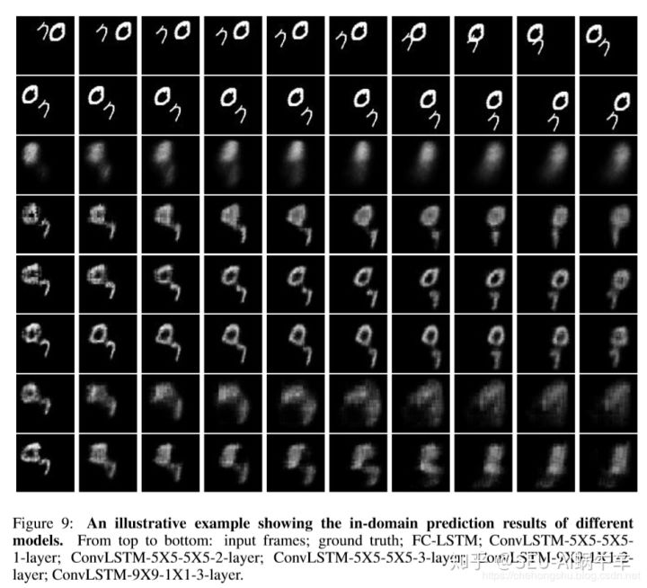

# Markdown 学习

## 标题

Ctrl+ 1 2 3 4 5 6

用#号


## 选择框

-空格[ ]空格内容

- [ ] 内容


## 字体

斜体：两边都加*   粗体：两边都加**  废弃：两边都加~~

**Hello，World**

*Hello,World*

***Hello,World***

~~Hello,World~~


## 引用

使用>+空格

> 选择
>
> 

## 分割线

三个-

---


图片



## 超链接

[名称](地址)     打开方式 ctrl+点击即可

[点击打开百度](https://www.bilibili.com/video/BV12J41137hu?p=6&spm_id_from=pageDriver)


## 列表   

退出引用格式和列表格式，按两次回车键

有序列表  数字.+空格

1. A
2. B
3. C
4. 


无序列表 减号+空格

- A
- B
- C


## 表格

一 右键插入

二  **|**|**| 源代码形式删除空行

ctrl+enter插入一行

### 一、默认表格

MarkDown制作表格使用`|`来分隔不同的单元格，使用`-`来分隔表头和其他行。

```java
|  表头   | 表头  |
|  ----  | ----  |
| 单元格  | 单元格 |
| 单元格  | 单元格 |
```


### 二、对齐方式

`-:` 设置内容和标题栏居右对齐。
`:-` 设置内容和标题栏居左对齐。
`:-:` 设置内容和标题栏居中对齐。

```jav
| 左对齐 | 右对齐 | 居中对齐 |
| :-----| ----: | :----: |
| 单元格 | 单元格 | 单元格 |
| 单元格 | 单元格 | 单元格 |
```

### 三、单元格换行

使用`<br>`换行符实现换行。

```java'
|  表头   | 表头  |
|  ----  | ----  |
| 单元格  | 第一行<br>第二行 |
| 单元格  | 单元格 |
```


姓名|性别|年龄|
--|--|--|
张三|男|17
姓名|性别|年龄


## 代码

三个点+java

```java
public
```

```java
ssh-rsa AAAAB3NzaC1yc2EAAAADAQABAAABgQDDmQEdQLjl5CNp5YQV2EJH4lNh9KXdwu34xMp1czz93I5TBt1DF5GLtYRbIEScZUovDr6G7lzBhc/GLF1H0nruMYg6eaUrpN38G44VEVhLWHkS6WhJoIoUHpFUWM6Tznpx8qQiNtOLuqeiZdgLYE5yDGbMlxLEfVwQTymIQKslwXSiaoDZIksWnTfXVIn4ad09shY3w7MLzbkSdPT0bisjFLliUwfjwzuJNnDaEABRRWUH1GQ3Z5rmHH9p5uMs1LiOA1Z45WvkMGoVeUYKkz1AiqRO1hRHY9HtjFt7bk0IcDBc+0ARh6y++G/bbo3Z99L2zxb4OiAbIF4iIhPtwpoYb+GiC7G/p+ZDXub65mt5jvOwcQfYBoxGoUvV/qM+Q4aBeV112/ib7wN/8tv/803ZC62nJP0GkSuIWdqSLkYussPzjZO9J/T5aar1MthwvJWTjKy1jb3+4WdUJ64O+6a/vB7wChsZCOW09+6ruP7Ff6RaPhBEIlDi9vuHNEDEkLU= sshkey
```

