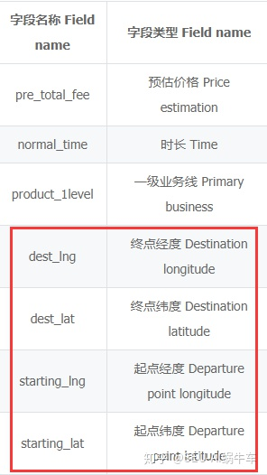
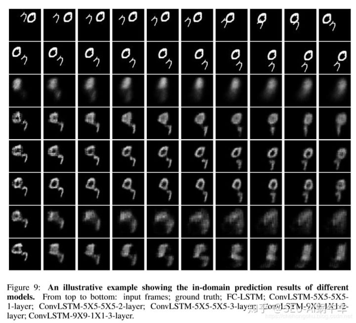
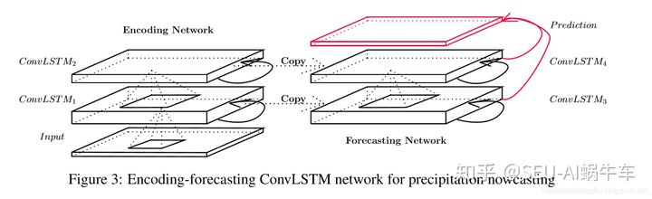

# 时空预测

https://blog.csdn.net/peihenglee2016/article/details/121220630

## WWW 2021 时空（多变量时序）预测论文汇总

https://zhuanlan.zhihu.com/p/393731082

https://github.com/alphabitsun/Spatiotemporal-Model/blob/main/README.md

https://github.com/alphabitsun/Spatio-Temporal-Prediction#traffic-prediction

# 一 时空序列预测第一篇

## 1.定义：什么是时空序列问题？

时间序列和时空序列时常有朋友搞混，并且很多朋友都以为我只感兴趣时间序列问题，其实不然，时空序列问题包含了时间和空间两个方面的因素。 这里时间其实指的就是前后的序列，这里空间也指向图片上的目标以及目标的移动和变化的空间信息，也指存在表格化数据中存在gps数据或者x、y或者经纬度的空间信息。 这里我已经引出了时空序列问题的两种形态。 1. 表格化数据
\2. 图片数据

### 1.1 表格化数据

表格化数据一般带有的特质就是数据中带有两个量，时间和地点的值，地点主要是经纬度。 比如下面这样，当然这个数据不是只有这些，还有时间等特征，不过太大了，这里就不截取了。

所以为什么说是时空序列问题？？ 首先有时间的前后推移和联系，也有空间上的起点和终点的坐标的变化，所以有时间的变化和联系也有空间上的，所以是时空序列问题

### 1.2 图片数据

其实表格化时空序列问题说实话我接触不多，还在学习中，大家多包涵，我涉猎的主要是图片数据。 这个问题说实话严格来说依然算是CV问题，但对于不同场景也可看做大数据和数据挖掘问题。 因为数据量确实大，我一直为这个显存而烦恼。

举个例子，比如这个序列输入为5个序列，一般都是雷达回波图或者卫星图，卫星图是1999乘1999，但一般都resize成330乘330，或者512乘512，那就是一个序列为5乘512乘512乘1，那一个bachsize大小就是1310720个数据，所以对于我这种穷苦的人一般bachsize都设为4就算很多了。

一般为图片数据和序列大家肯定会问具体眼睛看到啥样的，这里直接把最easy的数据集拿出来给大家看，也就是mnist-moving数据集

最上面十个为输入序列，下面为输出序列，在下面都是各种模型所预测的对比结果。 在这个数据集上，可以看到为什么叫时空序列问题，因为有数字的运动信息和本身数字的像素结构信息，还有序列的前后推移和联系，所以也是时空序列问题。

## 2这类问题主要应用了哪些模型？

### 2.1 时空序列模型

常用的有施行建博士的 ConvLSTM, 轨迹GRU 等等，以及利用上Unet-attention的时空序列模型，以及近年来的predrnn序列等等，虽然这个方向很少人研究，但是依然还是有很多力作持续输出。 对于时空序列模型，这里说两个这个领域的大牛。

施行建博士。港中文大学。 主要研究的方向是时空序列问题，时间维度为主，并且降水预测的应用。 以下截取了施博士2015年发的一篇很有基石效果的paper中的截图

### 2.2  主要的模型方法

- RNN最为主流

- - ConvLSTM
  - 轨迹GRU（这篇要着重看，shixingjian博士给出了一个完整的对于气象背景下的一个工程流程）
  - predrnn

- CNN

- - 主要是Unet的变形

  - - [SE-ResUnet](https://zhuanlan.zhihu.com/p/337149936)
    - [SmaAt-UNet](https://zhuanlan.zhihu.com/p/337352102)

- GAN

- - [DGGAN](https://zhuanlan.zhihu.com/p/206669457)

- 等等

## 3.主要应用在哪些领域？

毋庸置疑在智慧交通上是有巨大的作用和应用的，在台风预测、降水预测都有一定的应用价值，因为台风和降水这些都可以用雷达回波图或者卫星图来表示 ，通过对于这些图片序列进行预测来进行应用，所说的应用价值和场景有直接关系，比如台风和降水都是和我们直接相关或者人身安全和财产直接相关的，这对于个人、公司乃至城市、国家都有很强的价值，但是由于范围越大，越难预测，时间越长越难预测，所以这条路确实还是很难走，并且效果不容忍耐。 这条路还很长还需要不停的摸索和努力。

## 4、总结

通过一次偶然的机会，看到一位正在这个领域努力的大佬用四句五个字来概括了这个领域的整体问题。

空间不变性 空间可变性 时间不变性 时间可变性

是展望也是总结！ 非常好。

# 二. 时空序列预测第二篇

