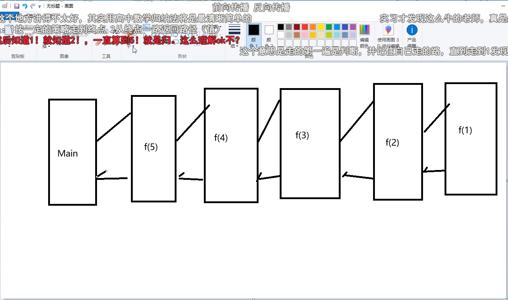

# 常见工具

## pdf转MD、HTML、word以及各种格式之间的相互转换

1. PDF 转 Word，Excel，PPT，JPG 的网址：https://smallpdf.com/cn/pdf-to-word

2. PDF 转 Markdown 的网址：https://pdf2md.morethan.io/

3. PDF 转 HTML 的网址：https://www.pdftohtml.net/

4. Word，Excel，PPT，JPG 转 PDF 的网址：https://smallpdf.com/cn/pdf-to-word

5. Markdown 转 PDF 的网址：http://open.rongcard.com/md2pdf

6. HTML 转 PDF 的网址： https://www.htm2pdf.co.uk/

7. Markdown 与 HTML，PDF，Doc 互转 的网址： http://coolaf.com/tool/md

8. HTML 与 Markdown 互转 的网址： http://www.bejson.com/convert/html2markdown/


# 常见Dos命令

打开方式：

1. cmd
2. 文件位置前+cmd空格

```bash
# 盘符切换
# 查看当前目录下的所有文件 dir
# 切换目录 cd change directory
cd ..   cd /d C:\Users\Administrator\Desktop 进入不同盘符
# 清理屏幕 cls (clear screen)
# 查看电脑的ip ipconfig
# 打开常用应用 calc：打开计算器 mspaint：打开画板 notepad：打开记事本
# 创建文件 md test 

# ping命令 
	ping www.baidu.com

# 文件操作
	md 目录名  创建目录
	rd 目录名  删除目录
	cd> 文件名 创建文件
	del 文件名 删除文件 

```

返回上一层目录       cd ../

# IDEA小技巧

1. 创建对象快捷键 alt+enter   或者按住shift点击灯泡


# Git常见命令

 克隆：**git clone** https:**//**github.com**/**tianqixin**/**runoob-git-test

## git上传文件步骤：

第一步：右击将要上传的文件夹，在右键菜单栏里选择Git Bash Here选项

第二步：在弹出的Git命令窗口中输入git init

第三步：复制gitee仓库的HTTPS链接(最好是ssh链接)

第四步：在Git命令窗口中输入git remote add origin+复制出来的仓库的HTTPS链接

第五步：在Git命令窗口中输入git pull origin master 并在弹出的窗口中输入码云登陆的对应的账号和密码(可以开始时弄好，设置无密码)

第六步：输入git add .（.表示所有文件）或者git add + 文件名（作用：将文件保存到缓存区）

第七步：输入git [commit](https://so.csdn.net/so/search?q=commit&spm=1001.2101.3001.7020) -m ‘文件描述’(文件描述的内容随便写)

第八步：输入git push origin master ，将本地仓库推送到远程仓库

第九步：完成以上操作后即可前往码云查看刚才上传的结果

[git上传步骤]: https://blog.csdn.net/qq_45083936/article/details/117327824


# 基础语法

## 一.数据类型

### 1.整型拓展

在我们计算机中存在很多进制问题，十进制，八进制，十六进制等等的问题，他们怎么表示呢？

```java
十进制整数，如：99, -500, 0。
八进制整数，要求以 0 开头，如：015。
十六进制数，要求 0x 或 0X 开头，如：0x15 。
```

```java
//整型
int i=10;
int i2=010;
int i3=0x10;
System.out.println(i); //10
System.out.println(i2); //8
System.out.println(i3); //16
```

### 2.浮点型拓展 

【金融面试问：银行金融业务用什么类型表示？】 浮点类型float, double的数据不适合在不容许舍入误差的金融计算领域。 如果需要进行不产生舍入误差的精确数字计算，需要使用BigDecimal类.

```java
public static void main(String[] args) {
	float f = 0.1f;
	double d = 1.0/10;
	System.out.println(f==d); //false
    
	float d1 = 2131231231f;
	float d2 = d1+1;
	if(d1==d2){
		System.out.println("d1==d2");
	}else{
		System.out.println("d1!=d2");
	}
}
```


主要理由： 由于字长有限，浮点数能够精确表示的数是有限的，因而也是离散的。浮点数一般都存在舍入误差，很 多数字无法精确表示，其结果只能是接近，但不等于；二进制浮点数不能精确的表示0.1,0.01,0.001这样 10的负次幂。并不是所有的小数都能可以精确的用二进制浮点数表示。

最好完全避免使用浮点数比较 ! 大数值：Java.math下面的两个有用的类：BigInteger和BigDecimal，这两个类可以处理任意长度的数 值。BigInteger实现了任意精度的整数运算。BigDecimal实现了任意精度的浮点运算。


浮点数使用总结：

1. 默认是double
2. 浮点数存在舍入误差，很多数字不能精确表示。如果需要进行不产生舍入误差的精确数字计算，需 要使用BigDecimal类。
3. 避免比较中使用浮点数


### 3.字符型拓展

单引号用来表示字符常量。例如‘A’是一个字符，它与“A”是不同的，“A”表示一个字符串。 char 类型用来表示在Unicode编码表中的字符。. Unicode编码被设计用来处理各种语言的所有文字，它占2个字节，可允许有65536个字符； 【科普：2字节=16位 2的16次方=65536，我们用的Excel原来就只有这么多行，并不是无限的】


## 二.类型转换


### 1、自动类型转换

自动类型转换：容量小的数据类型可以自动转换为容量大的数据类型。 例如: short数据类型的位数为16位，就可以自动转换位数为32的int类型，同样float数据类型的位数为 32，可以自动转换为64位的double类型。

```java
public class ZiDongLeiZhuan{
public static void main(String[] args){
	char c1='a';//定义一个char类型
	int i1 = c1;//char自动类型转换为int
	System.out.println("char自动类型转换为int后的值等于"+i1);
	char c2 = 'A';//定义一个char类型
	int i2 = c2+1;//char 类型和 int 类型计算
	System.out.println("char类型和int计算后的值等于"+i2);
	}
}
```

【解析：c1 的值为字符 a ,查 ASCII 码表可知对应的 int 类型值为 97， A 对应值为 65，所以 i2=65+1=66。】

### 2、常见错误和问题

#### 1.操作比较大的数时，要留意是否溢出，尤其是整数操作时；

```java
public static void main(String[] args) {
	int money = 1000000000; //10亿
	int years = 20;
	int total = money*years; //返回的是负数
	long total1 = money*years; //返回的仍然是负数。默认是int，因此结果会转成int值，再转成long。但是已经发生了数据丢失
	long total2 = money*((long)years); //先将一个因子变成long，整个表达式发生提升。全部用long来计算。
	System.out.println(total);
	System.out.println(total1);
	System.out.println(total2);
}
```

#### 2.L和l 的问题： 

不要命名名字为l的变量 

long类型使用大写L不要用小写。

#### 3.JDK 7 扩展

##### JDK7新特性: 二进制整数

由于我们在开发中也经常使用二进制整数，因此JDK7为我们直接提供了二进制整数的类型。

我们只要以：0b开头即可。

##### JDK7新特性：下划线分隔符

在实际开发和学习中，如果遇到特别长的数字，读懂它令人头疼！JDK7为我们提供了下划线分隔符，可以按照自己的习惯进行分割。

我们很容易就知道这是 1 亿 2234 万 5678 啦！ 非常符合国人的习惯！

```java
int a = 0b0101;
int b = 1 _ 2234 _ 5678 ;
```


## 三.变量，常量

### 1 .变量（variable）

### 2.变量作用域

变量根据作用域可划分为三种：

类变量（静态变量： static variable）：独立于方法之外的变量，用 static 修饰。

实例变量（成员变量：member variable）：独立于方法之外的变量，不过没有 static 修饰。

局部变量（lacal variable）：类的方法中的变量。

```java
public class Variable{
	static int allClicks= 0 ; // 类变量
	String str="hello world"; // 实例变量
	public void method(){
		int i = 0 ; // 局部变量
	}
}
```


### 3 、位运算符

右移一位相当于除 2 取商。 左移一位相当于乘 2 。

#### 【常见面试题：int a=2*8怎样运算效率最快？】

用移位运算 int a=2<<3;

a就是 2 乘以 8 最后结果是 16 这是最省内存 最有效率的方法

### 4 、字符串连接符

“+” 运算符两侧的操作数中 只要有一个是字符串 (String)类型，系统会自动将另一个操作数转换为字符串 然后再进行连接。


### 5 、三目条件运算符

三目条件运算符，语法格式：

```java
x? y : z
```

其中x为boolean类型表达式，先计算x的值，若为true，则整个三目运算的结果为表达式y的值，否则整个运算结果为表达式z的值。

#### 【演示】

```java
public static void main(String[] args) {
	int score = 80 ;
	String type = score < 60? "不及格" : "及格";
	System.out.println("type= " + type);
}
```

三元运算符在真实开发中十分的常见，大家可以多练习使用，之后我们会讲解分支语句，可以利用三元运算符做到更加精简代码！便于理解！


## 四.JavaDoc

### 1 、简介

JavaDoc是一种将注释生成HTML文档的技术，生成的HTML文档类似于Java的API，易读且清晰明了。

在简略介绍JavaDoc写法之后，再看一下在Intellij Idea 中如何将代码中的注释生成HTML文档。

javadoc是Sun公司提供的一个技术，它从程序源代码中抽取类、方法、成员等注释形成一个和源代码配套的API帮助文档。也就是说，只要在编写程序时以一套特定的标签作注释，在程序编写完成后，通过Javadoc就可以同时形成程序的开发文档了。javadoc命令是用来生成自己API文档的，使用方式：使用命令行在目标文件所在目录输入javadoc +文件名.java。

javadoc -encoding UTF-8 -charset UTF-8 文件名.java

```java
-encoding UTF-8 -charset UTF-8
//解决GBK乱码问题，在中间添加编码设置
```

## 五 .流程控制

### 1、Scanner对象

之前我们学的基本语法中我们并没有实现程序和人的交互，但是Java给我们提供了这样一个工具类，我 们可以获取用户的输入。java.util.Scanner 是 Java5 的新特征，我们可以通过 Scanner 类来获取用户的 输入。

下面是创建 Scanner 对象的基本语法：

`Scanner s = new Scanner(System.in);`

### 2、next & nextLine

```jav
public static void main(String[] args) {
    //创建一个扫描器对象，用于接收键盘数据
    Scanner scanner = new Scanner(System.in);
    //next方式接收字符串
    System.out.println("Next方式接收:");
    //判断用户还有没有输入字符
    if (scanner.hasNext()){
    String str = scanner.next();
    System.out.println("输入内容："+str);
    }
    //凡是属于IO流的类如果不关闭会一直占用资源.要养成好习惯用完就关掉.就好像你接水完了要关水龙头一样.很多下载软件或者视频软件如果你不彻底关,都会自己上传下载从而占用资源,你就会觉得卡,这一个道理.
    scanner.close();
}

```


测试数据：Hello World！ 结果：只输出了Hello。 接下来我们使用另一个方法来接收数据：nextLine()

```jav
public static void main(String[] args) {
    Scanner scan = new Scanner(System.in);
    // 从键盘接收数据
    // nextLine方式接收字符串
    System.out.println("nextLine方式接收：");
    // 判断是否还有输入
    if (scan.hasNextLine()) {
    String str2 = scan.nextLine();
    System.out.println("输入内容：" + str2);
    }
    scan.close();
}

```


两者区别： 

next(): 

1. 一定要读取到有效字符后才可以结束输入。 

2. 对输入有效字符之前遇到的空白，next() 方法会自动将其去掉。

3. 只有输入有效字符后才将其后面输入的空白作为分隔符或者结束符。

4. next() 不能得到带有空格的字符串。

 nextLine()： 

1. 以Enter为结束符,也就是说 nextLine()方法返回的是输入回车之前的所有字符。
2.  可以获得空白。


## 六. 方法

### 1.定义原则

原子性，一个方法只实现一个功能，这样利于我们后期的扩展。

### 2.方法的定义和调用

return不光可以返回值，也可以终止方法

注意：java都是值传递

### 3.方法的重载

重载原则：

1. 方法名必须相同
2. 方法的参数个数或者类型不相同

### 4.命令行传参

使用cmd 命令行执行java 程序必须回到src目录进行执行 

返回上一层目录 cd ../

java com.ty.basic.com.ty.method.Demo02 this is ok

### 5.可变参数

可变参数的定义必须在方法的最后一个参数，任何普通类型参数必须在它之前进行声明，并且一个方法只能定义一个可变参数 

void add(int a,double ...b)

### 6.递归


